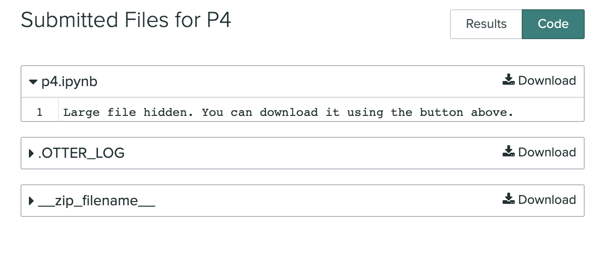
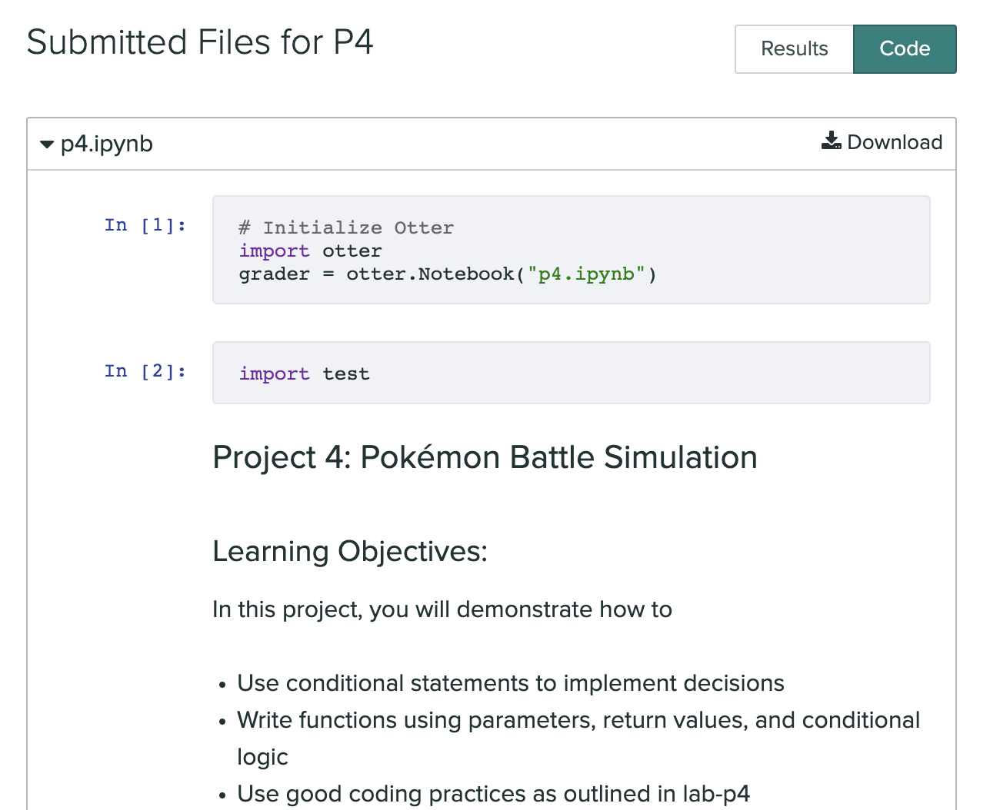

# Lab-P5: Looping Patterns and Hurricane API

---

## Segment 0: Fixing Gradescope issues with `p4.ipynb`

Before you start this lab, **please read** this message about your P4 submission:

We are facing an issue with project P4 submissions on Gradescope because of the Pokemon image that was embedded in the notebook file.
This has affected your code file from being displayed inline within Gradescope (see below image). With a class size of 1000+, it is impossible for us to download individual notebooks and grade them. So, we are asking you to fix this from your end.

If you see the above in your P4 submission, please take action as soon as possible to do the following:

- Delete the previously generated zip file (that you uploaded on Gradescope).
- Go to your solved `p4.ipynb` notebook file.
- Double click on the cell containing the image (begins with "In the first stage of this project, we will be simulating Pokémon battles.").
- Delete this line of markdown: ``.
- Kernel restart & clear output.
- Run each cell from the beginning (using shift + enter or Run button).
- Save the notebook file.
- Then run the export cell and upload the new zip file.
- **Verify that your code displays properly on Gradescope. You should see your code getting displayed like this:**

&nbsp;

To accommodate everyone to fix their P4 submissions, we are extending P4's deadline to **Friday, October 7th**. However, **P5's deadline will not be changed due to this.**

### After you finish this segment, you need to show your TA that your Gradescope screen to get full points on lab-p5. Otherwise, you will receive a maximum of 2 points (out of 5) for this lab.

If you have not finished P4 yet, or will not be able to attend the lab, you will have to **go to Office Hours** and show your Gradescope screen to a TA **before Friday, October 7th** to get full points on your lab.

---

With that done, let us start lab-p5! This lab introduces you to some fundamental looping patterns that will help solve p5. It is 
designed to help you become comfortable using the functions in `project.py`. You will also 
learn basic methods to manipulate strings needed for p5.

## Corrections and clarifications

None yet. 

**Find any issues?** Report to us: 

- Hafeez Anees Ali <aneesali@wisc.edu>
- Angela Garcia <garcia45@wisc.edu>

## Learning Objectives:
In this lab you will practice:
- inspecting the `project.py` file,
- iterating through data using a `for` loop,
- writing algorithms to search, filter, count, and find min / max,
- writing algorithms that use store an index
- writing helper functions,
- writing algorithms that manipulate strings.

## Introduction:
In this lab, you will look at hurricane data and learn techniques to extract specific data. Data 
scientists use such data when studying the effects of climate change.

According to the [Center for Climate and Energy Solutions](https://www.c2es.org/content/hurricanes-and-climate-change/), 
"Climate change is worsening hurricane impacts in the United States by increasing the intensity and decreasing the speed at 
which they travel. Scientists are currently uncertain whether there will be a change in the number
of hurricanes, but they are certain that the intensity and severity of hurricanes will continue to 
increase. These trends make hurricanes far more costly in terms of physical damage and deaths."
By tracking past hurricanes' speed, number of fatalaties, and property damage, scientists can prepare for
future ones.

## Note on Academic Misconduct

You may do these lab exercises only with your project partner; you are not allowed to start 
working on lab-p5 with one person, then do the project with a different partner. Now may be a 
good time to review [our course policies](https://cs220.cs.wisc.edu/f22/syllabus.html).

## Project Partner

We strongly recommend students find a project partner. Pair programming is a great way to learn
from a fellow student. Project difficulty increases exponentially in this course. Finding a project 
partner early on during the semester is a good idea.

If you are still looking for a project partner, take a moment to ask around the room if anyone 
would like to partner with you on this project. Then you can work with them on this lab and the 
project.

----------------------------------
## Segment 1: Setup

Create a `lab-p5` directory and download the following files into the `lab-p5` directory:

* `hurricanes.csv`
* `project.py`
* `practice.ipynb`
* `practice_test.py`

**Note:** If you accidentally downloaded the file as a `.txt` instead of `.csv` (or `.cvs` or `.csv.txt`) 
(say `hurricanes.cvs`), you can execute `mv hurricanes.cvs hurricanes.csv` on a 
Terminal/PowerShell window. Recall that the `mv` (move) command lets you rename a source file 
(first argument, example: `hurricanes.cvs`) to the destination file (second argument, example: 
`hurricanes.csv`).

Once you have downloaded the files, open a terminal and navigate to your `lab-p5` directory. 
Run `ls` to make sure the above files are available.

## Segment 2: Learning the API

You will be finishing the rest of your lab on `practice.ipynb`. Run the command `jupyter notebook` from your Terminal/PowerShell window. 
Remember not to close this 
Terminal/PowerShell window while Jupyter is running, and open a new Terminal/PowerShell 
window if necessary.

**Note**: For p5, you will be working on `p5.ipynb`, which is very similar to `practice.ipynb`. We 
strongly recommend that you finish working on this notebook during the lab, so you can ask 
your TA/PM any questions about the notebook that may arise.

**Note**: Unlike `p5.ipynb`, you do **not** have to submit `practice.ipynb`. This notebook is solely 
for your practice and preparation for p5.

------------------------------

You can now get started with [p5]((https://git.doit.wisc.edu/cdis/cs/courses/cs220/cs220-f22-projects/-/tree/main/p5)). **You may use any helper functions created here in project p5**. Remember to only work with p5 with your partner from this point on. Have fun!
