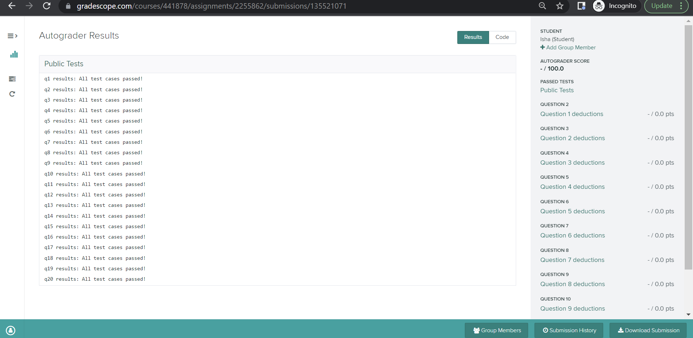

# Lab P6: Reading CSV Data from Airbnb

In this lab, you will practice accessing CSVs, sorting, and using sets. You will work with a real-world dataset and deal with issues that arise when using such datasets.

### Corrections/Clarifications

None yet

**Find any issues?** Report to us:

- Hafeez Anees Ali <aneesali@wisc.edu>
- Hakan Dingenc <dingenc@wisc.edu>

------------------------------
## Learning Objectives

In this lab, you will practice:
* accessing data directly from a CSV file,
* dealing with messy real-world datasets,
* using string functions to compare and extract data values,
* using sorting functions to order data,
* using sets to determine the unique values in a list

------------------------------
## Note on Academic Misconduct

You may do these lab exercises only with your project partner; you are not allowed to start 
working on lab-p6 with one person, then do the project with a different partner. Now may be a 
good time to review [our course policies](https://cs220.cs.wisc.edu/f22/syllabus.html).

## Project Partner

We strongly recommend students find a project partner. Pair programming is a great way to learn
from a fellow student. Project difficulty increases exponentially in this course. Finding a project 
partner early on during the semester is a good idea.

If you are still looking for a project partner, take a moment to ask around the room if anyone 
would like to partner with you on this project. Then you can work with them on this lab and the 
project.

If you completed the project with a partner, **make sure to add their name** by clicking "Add Group Member" 
in Gradescope when uploading the p6 zip file:
           
   

------------------------------
## Segment 1: Setup

Create a `lab-p6` directory and download the following files into the `lab-p6` directory.

* [`airbnb.csv`](https://git.doit.wisc.edu/cdis/cs/courses/cs220/cs220-f22-projects/-/raw/main/lab-p6/airbnb.csv)
* [`practice.ipynb`](https://git.doit.wisc.edu/cdis/cs/courses/cs220/cs220-f22-projects/-/blob/main/lab-p6/practice.ipynb)
* [`practice_test.py`](https://git.doit.wisc.edu/cdis/cs/courses/cs220/cs220-f22-projects/-/blob/main/lab-p6/practice_test.py)

If it takes too long to load the file `airbnb.csv` on GitLab, you can directly download the file from this link: [https://git.doit.wisc.edu/cdis/cs/courses/cs220/cs220-f22-projects/-/raw/main/lab-p6/airbnb.csv](https://git.doit.wisc.edu/cdis/cs/courses/cs220/cs220-f22-projects/-/raw/main/lab-p6/airbnb.csv). You will need to **Right Click**, and click on the **Save as...** button to save the file through this method.

**Note:** If you accidentally downloaded the file as a `.txt` instead of `.csv` (or `.cvs` or `.csv.txt`) 
(say `airbnb.cvs`), you can execute `mv airbnb.cvs airbnb.csv` on a 
Terminal/PowerShell window. Recall that the `mv` (move) command lets you rename a source file 
(first argument, example: `airbnb.cvs`) to the destination file (second argument, example: 
`airbnb.csv`).

**Warning:** Please make sure that the name of the file is `airbnb.csv` in your local computer. If your file has a different name on your computer, you may pass the *local tests*, but **fail** the tests on Gradescope.

To start, familiarize yourself with the dataset (`airbnb.csv`). Examine its contents using Microsoft Excel, Numbers (Mac) or any other spreadsheet viewing software.

------------------------------

## Segment 2: Working with `airbnb.csv`

You will be finishing the rest of your lab on `practice.ipynb`. Run the command `jupyter notebook` from your Terminal/PowerShell window. 
Remember not to close this 
Terminal/PowerShell window while Jupyter is running, and open a new Terminal/PowerShell 
window if necessary.

**Note**: For p6, you will be working on `p6.ipynb`, which is very similar to `practice.ipynb`. We 
strongly recommend that you finish working on this notebook during the lab, so you can ask 
your TA/PM any questions about the notebook that may arise.

**Note**: Unlike `p6.ipynb`, you do **not** have to submit `practice.ipynb`. This notebook is solely 
for your practice and preparation for p6.

------------------------------

## Segment 3: Otter tests check for project submission

This segment is informational only and has no tasks. Your work on `p6.ipynb` is not complete when you submit the project on Gradescope. It is your responsibility to make sure that your project clears auto-grader tests on the Gradescope test system. Otter test results should be available a few minutes after your submission. You should be able to see both PASS / FAIL results for the 20 test cases and your total score, which is accessible via Gradescope Dashboard. You must be able to see the following screen on Gradescope:
    
 
You **must** review the project's [rubric](https://git.doit.wisc.edu/cdis/cs/courses/cs220/cs220-f22-projects/-/blob/main/p6/rubric.md) and make sure that you have followed the directions provided in the project to solve the questions. The rubric is meant to reinforce your understanding of the project's directions. TAs and graders will be following the rubric to make deductions on your project submission during manual grading. Rubrics will become progressively stricter as we make progress during this semester.

To get full credit for this lab, you must acknowledge to the TA that you understand Segment 3's instructions.

## Project

Good luck with [p6](https://github.com/msyamkumar/cs220-s22-projects/tree/master/p6)!
