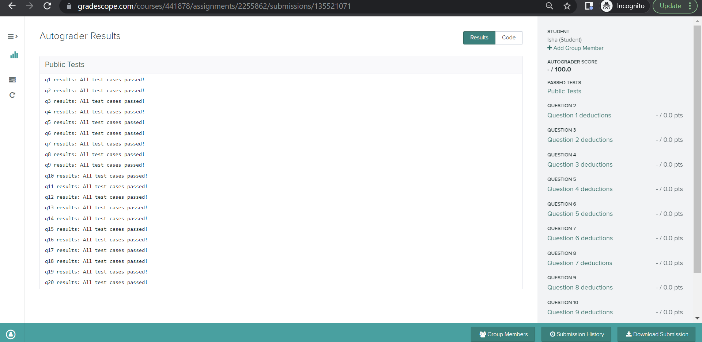

# Lab-P8: Lists and Dictionaries

This lab is designed to help you prepare for p8. We will focus on creating nested lists of dictionaries, mutating lists, and converting data in csv files into useful data structures.

## Corrections/Clarifications

**Find any issues?** Please report to us:

- Kincannon Wilson <kgwilson2@wisc.edu>
- Angela Garcia <garcia45@wisc.edu>

## Learning Objectives

In this lab, you will practice how to...
* Integrate relevant information from various sources (e.g. multiple csv files)
* Build appropriate data structures for organization and informative presentation (e.g. list of dictionaries)
* Practice good coding style

## Note on Academic Misconduct

You may do these lab exercises only with your project partner; you are not allowed to start 
working on lab-p8 with one person, then do the project with a different partner. Now may be a 
good time to review [our course policies](https://cs220.cs.wisc.edu/f22/syllabus.html).

**Important:** p8 and p9 are two parts of the same data analysis.
You **cannot** switch project partners between these two projects.
If you partner up with someone for p8, you have to sustain that partnership until end of p9.
**You must acknowledge that you have read this to your lab TA**.

## Project Partner

We strongly recommend students find a project partner. Pair programming is a great way to learn
from a fellow student. Project difficulty increases exponentially in this course. Finding a project 
partner early on during the semester is a good idea.

If you are still looking for a project partner, take a moment to ask around the room if anyone 
would like to partner with you on this project. Then you can work with them on this lab and the 
project.

------------------------------
## Segment 1: Setup

In this project and the next, we will be working on the [IMDb Movies Dataset](https://www.imdb.com/interfaces/). We will use Python to discover some cool facts about our favorite movies, actors, and directors.

In this lab, you will combine the data from the `small_movies.csv` and `small_mapping.csv` files into a more useful format. Create a `lab-p8` directory and download the following files into the `lab-p8` directory.

* `small_movies.csv`
* `small_mapping.csv`
* `practice.ipynb`
* `practice_test.py`

To start, familiarize yourself with the dataset (`small_movies.csv` and `small_mapping.csv`). Examine their contents using Microsoft Excel, Numbers (Mac) or any other spreadsheet viewing software.

------------------------------

## Segment 2: Parsing the CSV files

You will be finishing the rest of your lab on `practice.ipynb`. Run the command `jupyter notebook` from your Terminal/PowerShell window. 
Remember not to close this 
Terminal/PowerShell window while Jupyter is running, and open a new Terminal/PowerShell 
window if necessary.

**Note**: For p8, you will be working on `p8.ipynb`, which is very similar to `practice.ipynb`. We 
strongly recommend that you finish working on this notebook during the lab, so you can ask 
your TA/PM any questions about the notebook that may arise.

**Note**: Unlike `p8.ipynb`, you do **not** have to submit `practice.ipynb`. This notebook is solely 
for your practice and preparation for p8.

------------------------------

## Segment 3: Otter tests check for project submission

This segment is informational only and has no tasks. Your work on `p8.ipynb` is not complete when you submit the project on Gradescope. It is your responsibility to make sure that your project clears auto-grader tests on the Gradescope test system. Otter test results should be available in a few minutes after your submission. You should be able to see both PASS / FAIL results for the 20 test cases and your total score, which is accessible via Gradescope Dashboard. You must be able to see the following screen on Gradescope:
    

 
You **must** review the project's rubric and make sure that you have followed the directions provided in the project to solve the questions. The rubric is meant to reinforce your understanding of the project's directions. TAs and graders will be following the rubric to make deductions on your project submission during manual grading. Rubrics will become progressively stricter as we make progress during this semester.

------------------------------

## Project 8

You can now get started with [p8](https://git.doit.wisc.edu/cdis/cs/courses/cs220/cs220-f22-projects/-/tree/main/p8). **You may copy/paste any code created here in project p8**. Remember to only work on p8 and p9 with your partner from this point on. Have fun!
